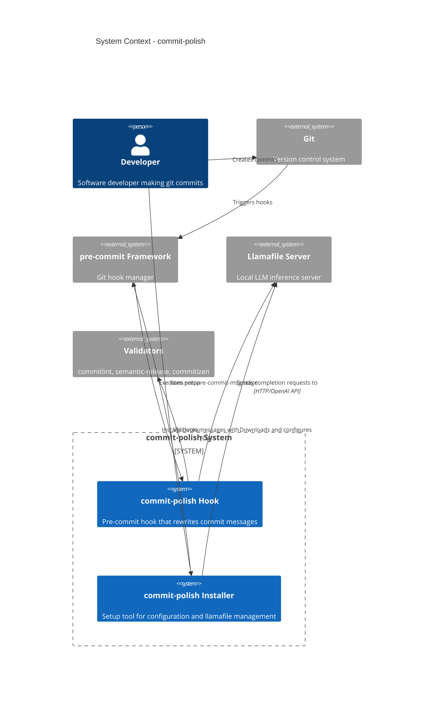
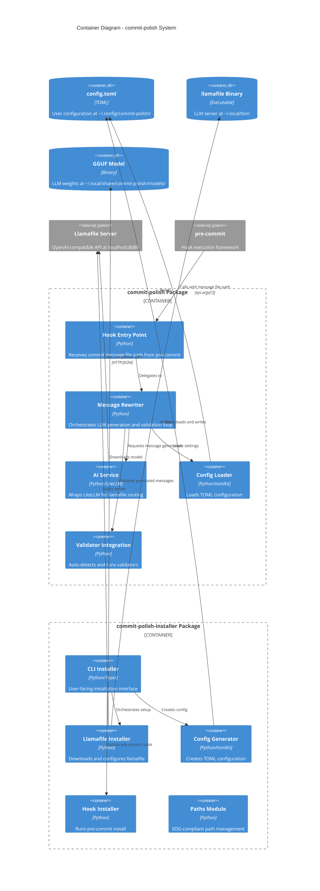

# commit-polish Architecture

## Executive Summary

commit-polish is a pre-commit hook system that automatically rewrites git commit messages to specified formats (Conventional Commits, JIRA style, etc.) using local LLMs via LiteLLM. The system consists of two packages: a lightweight runtime hook (`commit-polish`) and a setup tool (`commit-polish-installer`). The architecture prioritizes separation of concerns, local-first AI inference, and XDG-compliant configuration management.

**Key Architectural Decisions**:
- Separation of runtime hook from installation logic
- Local LLM inference via llamafile (no cloud dependencies)
- LiteLLM routing for OpenAI-compatible API abstraction
- Validation feedback loop with auto-detection of project conventions
- XDG Base Directory compliance for configuration and data

---

## System Context



**External Dependencies**:
- **Git**: Version control system triggering commit hooks
- **pre-commit**: Hook manager executing commit-polish at prepare-commit-msg stage
- **Llamafile**: Local LLM server providing OpenAI-compatible API
- **Validators** (optional): Tools like commitlint for message validation

---

## Container Architecture



---

## Package 1: commit-polish (Runtime Hook)

### Purpose
Lightweight runtime hook that reads configuration and rewrites commit messages using local LLM inference.

### Module Structure

```
packages/commit-polish/
├── pyproject.toml
├── .pre-commit-hooks.yaml
├── src/
│   └── commit_polish/
│       ├── __init__.py
│       ├── hook.py              # Entry point for pre-commit
│       ├── message_rewriter.py  # Core orchestration logic
│       ├── ai_service.py        # LiteLLM wrapper
│       ├── config.py            # Configuration loader
│       └── validators/          # Validator integrations
│           ├── __init__.py
│           ├── base.py          # Protocol definitions
│           ├── commitlint.py    # Commitlint integration
│           ├── semantic_release.py
│           └── detector.py      # Auto-detection logic
└── tests/
    ├── test_hook.py
    ├── test_message_rewriter.py
    ├── test_ai_service.py
    ├── test_config.py
    └── test_validators/
```

### Component Specifications

#### 1. hook.py (Entry Point)

**Purpose**: Pre-commit hook entry point that receives commit message file path.

**API Contract**:
```python
def main() -> int:
    """
    Entry point for prepare-commit-msg hook.

    Receives:
        sys.argv[1]: Path to commit message file (.git/COMMIT_EDITMSG)
        os.environ.get('PRE_COMMIT_COMMIT_MSG_SOURCE'): Optional message source
        os.environ.get('PRE_COMMIT_COMMIT_OBJECT_NAME'): Optional commit SHA

    Returns:
        0: Success (message rewritten)
        1: Error (commit aborted)
    """
```

**Responsibilities**:
- Parse sys.argv[1] for commit message file path
- Read original commit message from file
- Delegate to MessageRewriter for processing
- Write rewritten message back to file
- Handle errors gracefully (fail-fast on critical errors)

**Exit Codes**:
- 0: Success
- 1: Configuration error, LLM unavailable, or validation failure after max retries

#### 2. message_rewriter.py (Core Orchestration)

**Purpose**: Orchestrates LLM generation with validation feedback loop.

**API Contract**:
```python
from dataclasses import dataclass

@dataclass
class RewriteResult:
    success: bool
    message: str
    attempts: int
    validation_errors: list[str]

class MessageRewriter:
    def __init__(
        self,
        ai_service: AIService,
        config: Config,
        validator: Validator | None = None
    ) -> None: ...

    def rewrite_message(
        self,
        original_message: str,
        diff: str | None = None
    ) -> RewriteResult:
        """
        Rewrite commit message using LLM with validation loop.

        Algorithm:
            1. Extract system prompt from config or validator
            2. Call LLM to generate message
            3. If validator exists, validate generated message
            4. If validation fails and retries remain, feed errors to LLM and retry
            5. Return best message (valid or last attempt)

        Args:
            original_message: User's original commit message
            diff: Optional git diff output for context

        Returns:
            RewriteResult with final message and metadata
        """
```

**Validation Loop Logic**:
```
Attempt 1: LLM generates → Validator checks
           ↓ (if invalid)
Attempt 2: LLM generates with error feedback → Validator checks
           ↓ (if invalid)
Attempt 3: LLM generates with error feedback → Validator checks
           ↓ (if still invalid)
Return: Best effort message (last attempt)
```

**Max Retries**: 3 (configurable in config.toml)

#### 3. ai_service.py (LiteLLM Wrapper)

**Purpose**: Wraps LiteLLM for llamafile routing with proper error handling.

**API Contract**:
```python
from dataclasses import dataclass

@dataclass
class CompletionRequest:
    system_prompt: str
    user_prompt: str
    temperature: float = 0.3
    max_tokens: int = 200

@dataclass
class CompletionResponse:
    content: str
    model: str
    tokens_used: int

class AIService:
    def __init__(self, config: AIConfig) -> None: ...

    def complete(self, request: CompletionRequest) -> CompletionResponse:
        """
        Call LiteLLM completion API with llamafile routing.

        LiteLLM Configuration:
            model: "llamafile/gemma-3-3b" (MUST have llamafile/ prefix)
            api_base: "http://127.0.0.1:8080/v1" (port 8080, includes /v1)

        Raises:
            litellm.APIConnectionError: Llamafile server unreachable
            litellm.Timeout: Request timeout
            litellm.BadRequestError: Invalid request
        """

    async def acomplete(self, request: CompletionRequest) -> CompletionResponse:
        """Async version of complete()."""
```

**Critical Implementation Details**:
- Model prefix MUST be `llamafile/` for LiteLLM routing
- API base MUST be `http://127.0.0.1:8080/v1` (port 8080, not 8000)
- Import exceptions directly from `litellm`, NOT `litellm.exceptions`
- No API key required for llamafile models

**Error Handling Strategy**:
- `APIConnectionError`: Llamafile not running → Fail with clear message
- `Timeout`: Request took too long → Retry once, then fail
- `BadRequestError`: Invalid prompt → Log and fail
- Let other exceptions propagate for debugging

#### 4. config.py (Configuration Loader)

**Purpose**: Loads and validates TOML configuration using tomlkit.

**Configuration Schema**:
```toml
[ai]
model = "llamafile/gemma-3-3b"  # MUST have llamafile/ prefix
temperature = 0.3               # Float 0.0-1.0
max_tokens = 200                # Integer > 0

[llamafile]
path = "/home/user/.local/bin/llamafile"
model_path = "/home/user/.local/share/commit-polish/models/gemma-3-3b.gguf"

[validation]
auto_detect = true              # Auto-detect commitlint/semantic-release/commitizen
max_retries = 3                 # Integer >= 1
# Optional overrides:
# validator_command = "npx commitlint --from HEAD~1"
# system_prompt = "Custom system prompt"
```

**API Contract**:
```python
from dataclasses import dataclass
from pathlib import Path

@dataclass
class AIConfig:
    model: str
    temperature: float
    max_tokens: int

@dataclass
class LlamafileConfig:
    path: Path
    model_path: Path

@dataclass
class ValidationConfig:
    auto_detect: bool
    max_retries: int
    validator_command: str | None = None
    system_prompt: str | None = None

@dataclass
class Config:
    ai: AIConfig
    llamafile: LlamafileConfig
    validation: ValidationConfig

def load_config(path: Path | None = None) -> Config:
    """
    Load configuration from TOML file.

    Args:
        path: Optional explicit path. If None, uses get_config_file()

    Returns:
        Validated Config object

    Raises:
        FileNotFoundError: Config file not found
        tomlkit.exceptions.ParseError: Invalid TOML syntax
        ValueError: Invalid configuration values
    """

def get_config_file() -> Path:
    """Get XDG-compliant config file path: ~/.config/commit-polish/config.toml"""
```

**Default System Prompt** (when no validator config found):
```
Write a commit message in the Conventional Commits format. Use the structure:
<type>(<optional scope>): <short description>

<optional body>

<optional footer>

Example types: feat, fix, docs, style, refactor, perf, test, build, ci, chore, revert
Optionally, include a body for more details in bullet points.
Optionally, in the footer, use BREAKING CHANGE: followed by a detailed explanation of the breaking change.

Just return the commit message, do not include any other text.
```

#### 5. validators/ (Validator Integration)

**Purpose**: Auto-detect and integrate with external commit message validators.

**Module Structure**:
- `base.py`: Protocol definitions for validators
- `detector.py`: Auto-detection logic
- `commitlint.py`: Commitlint integration
- `semantic_release.py`: Semantic-release integration
- `commitizen.py`: Commitizen integration (future)

**API Contract**:
```python
from typing import Protocol

class Validator(Protocol):
    """Protocol for commit message validators."""

    def validate(self, message: str) -> tuple[bool, list[str]]:
        """
        Validate commit message.

        Returns:
            (is_valid, error_messages)
        """

    def get_system_prompt_additions(self) -> str:
        """
        Get additional prompt instructions based on validator config.

        Example: "Allowed types: feat, fix, docs, chore"
        """

def detect_validator(repo_path: Path) -> Validator | None:
    """
    Auto-detect validator configuration in repository.

    Detection order:
        1. commitlint: Check for commitlint.config.js, .commitlintrc, etc.
        2. semantic-release: Check for release.config.js
        3. commitizen: Check for .cz.json

    Returns:
        Validator instance or None
    """
```

**Commitlint Detection** (commitlint.py):
```python
COMMITLINT_CONFIG_FILES = [
    'commitlint.config.js',
    'commitlint.config.cjs',
    'commitlint.config.mjs',
    '.commitlintrc',
    '.commitlintrc.json',
    '.commitlintrc.js',
    '.commitlintrc.cjs',
]

class CommitlintValidator:
    def __init__(self, config_path: Path) -> None: ...

    def validate(self, message: str) -> tuple[bool, list[str]]:
        """
        Validate message by running: npx commitlint

        Returns:
            (True, []) if valid
            (False, ["error 1", "error 2"]) if invalid
        """

    def get_system_prompt_additions(self) -> str:
        """
        Extract allowed types from commitlint config.

        Example output:
        "Allowed types: feat, fix, docs, style, refactor, test, chore"
        """
```

**Validator Integration Flow**:
```
1. Auto-detection (validators/detector.py):
   - Search for commitlint config files
   - Search for semantic-release config
   - Search for commitizen config
   - Return first found or None

2. Prompt Enhancement:
   - If validator found, append validator.get_system_prompt_additions()
   - Otherwise use default Conventional Commits prompt

3. Validation Loop:
   - Generate message with LLM
   - Call validator.validate(message)
   - If invalid, feed errors back to LLM
   - Retry up to max_retries times
```

### Pre-commit Hook Configuration

**File**: `.pre-commit-hooks.yaml`

```yaml
- id: commit-polish
  name: Polish Commit Message
  description: Rewrites commit messages using local LLM
  entry: commit-polish
  language: python
  stages: [prepare-commit-msg]  # MUST be prepare-commit-msg for rewriting
  pass_filenames: false          # Hook receives message file path, not staged files
  always_run: true               # Run even without file changes
```

**Critical Requirements**:
- `stages: [prepare-commit-msg]` - NOT `commit-msg` (prepare-commit-msg allows rewriting)
- `pass_filenames: false` - Hook doesn't process files, only message file
- `always_run: true` - Run for all commits, including empty commits

### Dependencies

**pyproject.toml**:
```toml
[project]
name = "commit-polish"
version = "0.1.0"
description = "AI-powered commit message polisher"
requires-python = ">=3.11"
dependencies = [
    "litellm>=1.0.0",
    "tomlkit>=0.13.0",
]

[project.scripts]
commit-polish = "commit_polish.hook:main"

[build-system]
requires = ["uv_build>=0.9.2,<0.10.0"]
build-backend = "uv_build"

[dependency-groups]
dev = [
    "pytest>=8.0",
    "pytest-asyncio>=0.23",
    "pytest-mock>=3.14",
    "ruff>=0.4",
    "mypy>=1.10",
]
```

**No Installation Logic**: Hook assumes configuration exists at `~/.config/commit-polish/config.toml`

---

## Package 2: commit-polish-installer (Setup Tool)

### Purpose
User-facing tool that downloads llamafile, creates configuration, and sets up pre-commit hooks.

### Module Structure

```
packages/commit-polish-installer/
├── pyproject.toml
├── src/
│   └── commit_polish_installer/
│       ├── __init__.py
│       ├── cli.py                  # Typer CLI interface
│       ├── llamafile_installer.py  # Llamafile download and setup
│       ├── config_generator.py     # TOML config creation
│       ├── hook_installer.py       # pre-commit installation
│       ├── paths.py                # XDG path management
│       └── server_manager.py       # Llamafile server lifecycle
└── tests/
    ├── test_cli.py
    ├── test_llamafile_installer.py
    ├── test_config_generator.py
    └── test_paths.py
```

### Component Specifications

#### 1. cli.py (CLI Interface)

**Purpose**: User-facing Typer CLI for installation and management.

**API Contract**:
```python
import typer
from typing_extensions import Annotated

app = typer.Typer()

@app.command()
def install(
    model: Annotated[str, typer.Option(help="Model to download")] = "gemma-3-3b",
    start_server: Annotated[bool, typer.Option(help="Start llamafile server after install")] = True,
    dry_run: Annotated[bool, typer.Option(help="Show what would be done")] = False,
) -> None:
    """
    Install commit-polish: download llamafile, model, create config, install pre-commit hook.

    Steps:
        1. Download llamafile binary to ~/.local/bin/llamafile
        2. Download model GGUF to ~/.local/share/commit-polish/models/
        3. Create config at ~/.config/commit-polish/config.toml
        4. Run pre-commit install --hook-type prepare-commit-msg
        5. Optionally start llamafile server
    """

@app.command()
def server(
    action: Annotated[str, typer.Argument(help="start, stop, status")],
) -> None:
    """
    Manage llamafile server.

    Actions:
        start: Start server in background
        stop: Stop running server
        status: Check server status
    """

@app.command()
def config(
    show: Annotated[bool, typer.Option(help="Show current config")] = False,
    edit: Annotated[bool, typer.Option(help="Open config in editor")] = False,
) -> None:
    """Show or edit configuration."""
```

**Entry Point** (pyproject.toml):
```toml
[project.scripts]
commit-polish-install = "commit_polish_installer.cli:app"
```

#### 2. llamafile_installer.py (Llamafile Setup)

**Purpose**: Downloads llamafile binary and model, makes executable.

**API Contract**:
```python
from pathlib import Path
from dataclasses import dataclass

@dataclass
class LlamafileConfig:
    version: str = "0.9.3"
    download_url: str = "https://github.com/mozilla-ai/llamafile/releases/download/0.9.3/llamafile-0.9.3"
    install_path: Path = Path.home() / ".local" / "bin" / "llamafile"

@dataclass
class ModelConfig:
    name: str = "gemma-3-3b"
    download_url: str = "https://huggingface.co/Mozilla/gemma-3-3b-it-gguf/resolve/main/gemma-3-3b-it-Q4_K_M.gguf"
    install_path: Path = Path.home() / ".local" / "share" / "commit-polish" / "models" / "gemma-3-3b.gguf"

class LlamafileInstaller:
    def install_llamafile(self, config: LlamafileConfig = LlamafileConfig()) -> Path:
        """
        Download llamafile binary and make executable.

        Steps:
            1. Create parent directory (mkdir -p)
            2. Download from GitHub releases
            3. Write to install_path
            4. chmod 755 (make executable)

        Returns:
            Path to installed llamafile binary

        Raises:
            HTTPError: Download failed
            PermissionError: Cannot write to install path
        """

    def install_model(self, config: ModelConfig = ModelConfig()) -> Path:
        """
        Download GGUF model file.

        Steps:
            1. Create models directory
            2. Download from Hugging Face
            3. Write to install_path
            4. Verify file size

        Returns:
            Path to downloaded model file
        """
```

**Critical URLs and Versions**:
- Llamafile version: **0.9.3**
- Download URL: `https://github.com/mozilla-ai/llamafile/releases/download/0.9.3/llamafile-0.9.3`
- Recommended model: **Gemma 3 3B Q4_K_M** (~2GB)
- Model URL: `https://huggingface.co/Mozilla/gemma-3-3b-it-gguf/resolve/main/gemma-3-3b-it-Q4_K_M.gguf`

**Installation Locations** (XDG-compliant):
- Binary: `~/.local/bin/llamafile`
- Model: `~/.local/share/commit-polish/models/gemma-3-3b.gguf`

#### 3. config_generator.py (Configuration Creation)

**Purpose**: Creates TOML configuration file with tomlkit.

**API Contract**:
```python
from pathlib import Path
import tomlkit

class ConfigGenerator:
    def generate_config(
        self,
        llamafile_path: Path,
        model_path: Path,
        output_path: Path | None = None,
    ) -> Path:
        """
        Generate config.toml file.

        Args:
            llamafile_path: Path to llamafile binary
            model_path: Path to GGUF model file
            output_path: Optional output path (defaults to XDG config)

        Returns:
            Path to written config file
        """
```

**Generated Configuration Structure**:
```toml
[ai]
model = "llamafile/gemma-3-3b"  # MUST have llamafile/ prefix
temperature = 0.3
max_tokens = 200

[llamafile]
path = "/home/user/.local/bin/llamafile"
model_path = "/home/user/.local/share/commit-polish/models/gemma-3-3b.gguf"

[validation]
auto_detect = true
max_retries = 3
```

**Implementation Notes**:
- Use `tomlkit.dump()` for writing
- Open file in text write mode (`'w'`)
- Create parent directories with `mkdir(parents=True, exist_ok=True)`
- tomlkit preserves comments and formatting

#### 4. hook_installer.py (Pre-commit Setup)

**Purpose**: Runs pre-commit installation commands.

**API Contract**:
```python
import subprocess
from pathlib import Path

class HookInstaller:
    def install_hook(self, repo_path: Path | None = None) -> None:
        """
        Install pre-commit hook using pre-commit framework.

        Steps:
            1. Verify pre-commit is installed (check which pre-commit)
            2. Change to repo_path (or current directory)
            3. Run: pre-commit install --hook-type prepare-commit-msg

        Raises:
            FileNotFoundError: pre-commit not installed
            subprocess.CalledProcessError: Installation failed
        """

    def verify_installation(self) -> bool:
        """
        Verify hook is installed.

        Checks:
            - .git/hooks/prepare-commit-msg exists
            - File contains "pre-commit" reference

        Returns:
            True if installed correctly
        """
```

**Pre-commit Installation Command**:
```bash
pre-commit install --hook-type prepare-commit-msg
```

**Critical**: MUST use `--hook-type prepare-commit-msg` (not default `pre-commit` stage)

#### 5. paths.py (XDG Path Management)

**Purpose**: Provides XDG-compliant path management.

**API Contract**:
```python
from pathlib import Path
import os

APP_NAME = "commit-polish"

def get_config_dir() -> Path:
    """Get XDG_CONFIG_HOME/commit-polish (~/.config/commit-polish)."""
    xdg = os.environ.get('XDG_CONFIG_HOME')
    base = Path(xdg) if xdg else Path.home() / '.config'
    return base / APP_NAME

def get_config_file() -> Path:
    """Get config file path (~/.config/commit-polish/config.toml)."""
    return get_config_dir() / 'config.toml'

def get_data_dir() -> Path:
    """Get XDG_DATA_HOME/commit-polish (~/.local/share/commit-polish)."""
    xdg = os.environ.get('XDG_DATA_HOME')
    base = Path(xdg) if xdg else Path.home() / '.local' / 'share'
    return base / APP_NAME

def get_models_dir() -> Path:
    """Get models directory (~/.local/share/commit-polish/models)."""
    return get_data_dir() / 'models'

def get_cache_dir() -> Path:
    """Get XDG_CACHE_HOME/commit-polish (~/.cache/commit-polish)."""
    xdg = os.environ.get('XDG_CACHE_HOME')
    base = Path(xdg) if xdg else Path.home() / '.cache'
    return base / APP_NAME

def ensure_directories() -> None:
    """Create all required directories with parents."""
    get_config_dir().mkdir(parents=True, exist_ok=True)
    get_data_dir().mkdir(parents=True, exist_ok=True)
    get_models_dir().mkdir(parents=True, exist_ok=True)
    get_cache_dir().mkdir(parents=True, exist_ok=True)
```

**Directory Structure**:
```
~/.config/commit-polish/          # XDG_CONFIG_HOME
    config.toml                   # Main configuration

~/.local/share/commit-polish/     # XDG_DATA_HOME
    models/                       # LLM model files
        gemma-3-3b.gguf

~/.local/bin/                     # User binaries
    llamafile                     # Llamafile binary

~/.cache/commit-polish/           # XDG_CACHE_HOME
    (temporary files)
```

#### 6. server_manager.py (Server Lifecycle)

**Purpose**: Manage llamafile server start/stop/status.

**API Contract**:
```python
import subprocess
from pathlib import Path

class ServerManager:
    def __init__(self, llamafile_path: Path, model_path: Path) -> None: ...

    def start_server(
        self,
        port: int = 8080,
        host: str = "127.0.0.1",
        background: bool = True,
    ) -> subprocess.Popen | None:
        """
        Start llamafile server.

        Command:
            ./llamafile --server -m model.gguf --nobrowser --port 8080 --host 127.0.0.1

        Args:
            port: Server port (default 8080)
            host: Bind address (default 127.0.0.1)
            background: Run as background process

        Returns:
            Process handle if background, None if foreground
        """

    def stop_server(self) -> None:
        """Stop running llamafile server (find by port and kill)."""

    def check_status(self) -> bool:
        """
        Check if server is running.

        Method: Curl http://localhost:8080/health or similar

        Returns:
            True if server responds
        """
```

**Server Command**:
```bash
./llamafile --server \
    -m /path/to/model.gguf \
    --nobrowser \
    --port 8080 \
    --host 127.0.0.1
```

**Critical**: Port MUST be **8080** (not 8000)

### Dependencies

**pyproject.toml**:
```toml
[project]
name = "commit-polish-installer"
version = "0.1.0"
description = "Setup tool for commit-polish"
requires-python = ">=3.11"
dependencies = [
    "typer>=0.9.0",
    "tomlkit>=0.13.0",
    "rich>=13.0.0",
    "httpx>=0.25.0",  # For downloads
]

[project.scripts]
commit-polish-install = "commit_polish_installer.cli:app"

[build-system]
requires = ["uv_build>=0.9.2,<0.10.0"]
build-backend = "uv_build"

[dependency-groups]
dev = [
    "pytest>=8.0",
    "ruff>=0.4",
    "mypy>=1.10",
]
```

---

## Technology Stack

### Core Dependencies

| Technology | Version | Purpose | Package |
|------------|---------|---------|---------|
| **Python** | 3.11+ | Runtime | Both |
| **LiteLLM** | >=1.0.0 | LLM API abstraction | commit-polish |
| **tomlkit** | >=0.13.0 | TOML read/write | Both |
| **Typer** | >=0.9.0 | CLI framework | installer |
| **Rich** | >=13.0.0 | Terminal output | installer |
| **httpx** | >=0.25.0 | HTTP downloads | installer |
| **uv** | latest | Package manager | Both |

### External Tools

| Tool | Version | Purpose |
|------|---------|---------|
| **Llamafile** | 0.9.3 | Local LLM server |
| **pre-commit** | >=2.0.0 | Hook framework |
| **commitlint** | Latest | Optional validator |
| **semantic-release** | Latest | Optional validator |

### LiteLLM Integration

**Model Naming Convention**:
- Prefix: `llamafile/` (REQUIRED for routing)
- Example: `llamafile/gemma-3-3b`

**API Configuration**:
- Base URL: `http://127.0.0.1:8080/v1` (port 8080, includes /v1 suffix)
- No API key required

**Exception Handling**:
```python
from litellm import (
    APIConnectionError,  # Connection failed
    Timeout,            # Request timeout
    BadRequestError,    # Invalid request
)
```

**Critical**: Import directly from `litellm`, NOT `litellm.exceptions`

---

## Data Flow Architecture

### End-to-End Commit Flow

```
┌─────────────────────────────────────────────────────────────────────────┐
│ 1. Developer runs: git commit -m "add feature"                         │
└────────────────────────┬────────────────────────────────────────────────┘
                         │
                         v
┌─────────────────────────────────────────────────────────────────────────┐
│ 2. Git triggers pre-commit framework                                   │
└────────────────────────┬────────────────────────────────────────────────┘
                         │
                         v
┌─────────────────────────────────────────────────────────────────────────┐
│ 3. pre-commit executes prepare-commit-msg stage hook                   │
│    - Passes .git/COMMIT_EDITMSG path as sys.argv[1]                    │
└────────────────────────┬────────────────────────────────────────────────┘
                         │
                         v
┌─────────────────────────────────────────────────────────────────────────┐
│ 4. commit-polish hook.py main()                                        │
│    - Reads commit message from file                                    │
│    - Loads config from ~/.config/commit-polish/config.toml             │
└────────────────────────┬────────────────────────────────────────────────┘
                         │
                         v
┌─────────────────────────────────────────────────────────────────────────┐
│ 5. MessageRewriter.rewrite_message()                                   │
│    - Auto-detects validator (commitlint/semantic-release/commitizen)   │
│    - Builds system prompt with validator rules                         │
└────────────────────────┬────────────────────────────────────────────────┘
                         │
                         v
┌─────────────────────────────────────────────────────────────────────────┐
│ 6. AIService.complete() calls LiteLLM                                  │
│    - Model: "llamafile/gemma-3-3b"                                     │
│    - API: http://127.0.0.1:8080/v1/chat/completions                    │
└────────────────────────┬────────────────────────────────────────────────┘
                         │
                         v
┌─────────────────────────────────────────────────────────────────────────┐
│ 7. Llamafile server processes request                                  │
│    - Loads Gemma 3B model                                              │
│    - Generates commit message                                          │
│    - Returns completion                                                │
└────────────────────────┬────────────────────────────────────────────────┘
                         │
                         v
┌─────────────────────────────────────────────────────────────────────────┐
│ 8. Validator.validate() checks generated message (if configured)       │
│    - Runs: npx commitlint (or semantic-release check)                  │
│    - Returns: (is_valid, error_messages)                               │
└────────────────────────┬────────────────────────────────────────────────┘
                         │
                 ┌───────┴───────┐
                 │               │
            Valid│               │Invalid & retries remain
                 v               v
    ┌────────────────┐   ┌──────────────────────┐
    │ Return message │   │ Retry with errors    │
    │                │   │ fed to LLM (steps    │
    │                │   │ 6-8 repeated)        │
    └────────┬───────┘   └──────────┬───────────┘
             │                      │
             │ ◄────────────────────┘ (max 3 attempts)
             │
             v
┌─────────────────────────────────────────────────────────────────────────┐
│ 9. hook.py writes rewritten message to .git/COMMIT_EDITMSG             │
└────────────────────────┬────────────────────────────────────────────────┘
                         │
                         v
┌─────────────────────────────────────────────────────────────────────────┐
│ 10. Git opens editor (or skips if -m flag) with polished message       │
│     User can edit or accept                                            │
└─────────────────────────────────────────────────────────────────────────┘
```

### Validation Feedback Loop Detail

```
Attempt 1:
  User message: "add feature"
  System prompt: "Write Conventional Commits. Allowed types: feat, fix, docs..."
  LLM generates: "feat: add new user authentication feature"
  Validator check: ✓ Valid
  → Return message

Attempt 2 (if invalid):
  User message: "add feature"
  System prompt: "Write Conventional Commits. Allowed types: feat, fix, docs..."
  Previous errors: "subject exceeds 72 chars, header-max-length: 100"
  LLM generates: "feat: add user auth"
  Validator check: ✓ Valid
  → Return message

Attempt 3 (if still invalid):
  (same pattern with cumulative error feedback)
  → Return best effort (last attempt)
```

---

## Configuration Architecture

### Configuration File Schema

**Location**: `~/.config/commit-polish/config.toml` (XDG-compliant)

**Full Schema with Comments**:
```toml
# AI Configuration
[ai]
# Model name (MUST have llamafile/ prefix for LiteLLM routing)
model = "llamafile/gemma-3-3b"

# Temperature for generation (0.0 = deterministic, 1.0 = creative)
# Range: 0.0-1.0
temperature = 0.3

# Maximum tokens in generated message
# Range: 1-1000 (200 recommended for commit messages)
max_tokens = 200

# Llamafile Configuration
[llamafile]
# Path to llamafile binary
path = "/home/user/.local/bin/llamafile"

# Path to GGUF model file
model_path = "/home/user/.local/share/commit-polish/models/gemma-3-3b.gguf"

# Validation Configuration
[validation]
# Auto-detect validators (commitlint, semantic-release, commitizen)
auto_detect = true

# Maximum retry attempts if validation fails
# Range: 1-10 (3 recommended)
max_retries = 3

# Optional: Custom validator command (overrides auto-detection)
# validator_command = "npx commitlint --from HEAD~1"

# Optional: Custom system prompt (overrides default and validator-derived prompts)
# system_prompt = """
# Write a commit message in JIRA style: PROJ-123: Description
# """
```

### Configuration Validation Rules

**Required Fields**:
- `ai.model`: Must start with `llamafile/`
- `ai.temperature`: Float 0.0-1.0
- `ai.max_tokens`: Integer >= 1
- `llamafile.path`: Valid file path (checked at runtime)
- `llamafile.model_path`: Valid file path (checked at runtime)
- `validation.max_retries`: Integer >= 1

**Default Values** (if config file missing or incomplete):
```python
DEFAULT_CONFIG = {
    "ai": {
        "model": "llamafile/gemma-3-3b",
        "temperature": 0.3,
        "max_tokens": 200,
    },
    "validation": {
        "auto_detect": True,
        "max_retries": 3,
    },
}
```

### Configuration Loading Priority

```
1. Explicit path (if provided to load_config())
2. XDG_CONFIG_HOME/commit-polish/config.toml (if XDG_CONFIG_HOME set)
3. ~/.config/commit-polish/config.toml (XDG default)
4. Error if not found (installer creates config before hook runs)
```

### Environment Variable Overrides

**Optional Feature** (future enhancement):
```bash
# Override model at runtime
export COMMIT_POLISH_MODEL="llamafile/mistral-7b"

# Override temperature
export COMMIT_POLISH_TEMPERATURE="0.5"
```

---

## Deployment Architecture

### Installation Flow

```
┌─────────────────────────────────────────────────────────────────────────┐
│ User runs: uvx commit-polish-install                                   │
└────────────────────────┬────────────────────────────────────────────────┘
                         │
                         v
┌─────────────────────────────────────────────────────────────────────────┐
│ 1. Installer CLI starts (cli.py)                                       │
│    - Parses arguments (model name, options)                            │
│    - Validates pre-commit is installed                                 │
└────────────────────────┬────────────────────────────────────────────────┘
                         │
                         v
┌─────────────────────────────────────────────────────────────────────────┐
│ 2. LlamafileInstaller.install_llamafile()                              │
│    - Downloads: https://github.com/mozilla-ai/llamafile/releases/.../  │
│    - Writes to: ~/.local/bin/llamafile                                 │
│    - chmod 755                                                         │
└────────────────────────┬────────────────────────────────────────────────┘
                         │
                         v
┌─────────────────────────────────────────────────────────────────────────┐
│ 3. LlamafileInstaller.install_model()                                  │
│    - Downloads: https://huggingface.co/Mozilla/gemma-3-3b-it-gguf/...  │
│    - Writes to: ~/.local/share/commit-polish/models/gemma-3-3b.gguf    │
│    - Verifies file size (~2GB)                                         │
└────────────────────────┬────────────────────────────────────────────────┘
                         │
                         v
┌─────────────────────────────────────────────────────────────────────────┐
│ 4. ConfigGenerator.generate_config()                                   │
│    - Creates: ~/.config/commit-polish/config.toml                      │
│    - Writes AI, llamafile, validation sections                         │
└────────────────────────┬────────────────────────────────────────────────┘
                         │
                         v
┌─────────────────────────────────────────────────────────────────────────┐
│ 5. HookInstaller.install_hook()                                        │
│    - Runs: pre-commit install --hook-type prepare-commit-msg           │
│    - Verifies: .git/hooks/prepare-commit-msg exists                    │
└────────────────────────┬────────────────────────────────────────────────┘
                         │
                         v
┌─────────────────────────────────────────────────────────────────────────┐
│ 6. ServerManager.start_server() (if --start-server flag)               │
│    - Runs: ./llamafile --server -m model.gguf --port 8080              │
│    - Daemonizes process                                                │
│    - Verifies: http://localhost:8080/health                            │
└─────────────────────────────────────────────────────────────────────────┘
```

### User Installation Commands

**Option 1: uvx (Recommended - No Installation)**:
```bash
# Run installer without installing
uvx commit-polish-install

# With options
uvx commit-polish-install --model gemma-3-3b --start-server
```

**Option 2: uv tool install (Global Installation)**:
```bash
# Install globally
uv tool install commit-polish-installer

# Run
commit-polish-install
```

**Option 3: pipx (Alternative)**:
```bash
pipx install commit-polish-installer
commit-polish-install
```

### Post-Installation Verification

```bash
# 1. Check files exist
ls -la ~/.local/bin/llamafile
ls -la ~/.local/share/commit-polish/models/gemma-3-3b.gguf
ls -la ~/.config/commit-polish/config.toml
ls -la .git/hooks/prepare-commit-msg

# 2. Verify llamafile is executable
~/.local/bin/llamafile --version

# 3. Check server is running
curl http://localhost:8080/health

# 4. Test hook manually
echo "test commit" > /tmp/test-msg
uv run commit-polish /tmp/test-msg
cat /tmp/test-msg  # Should show polished message

# 5. Make a real commit (hook runs automatically)
git commit -m "add feature"
```

### Uninstallation

```bash
# 1. Remove pre-commit hook
pre-commit uninstall --hook-type prepare-commit-msg

# 2. Stop server
pkill llamafile

# 3. Remove files
rm ~/.local/bin/llamafile
rm -rf ~/.local/share/commit-polish/
rm -rf ~/.config/commit-polish/
rm -rf ~/.cache/commit-polish/
```

---

## Error Handling Strategy

### Error Categories and Responses

| Error Category | Detection | Response | Exit Code |
|----------------|-----------|----------|-----------|
| **Configuration Missing** | FileNotFoundError on config.toml | Display setup instructions | 1 |
| **Llamafile Not Running** | APIConnectionError from LiteLLM | Suggest starting server | 1 |
| **Invalid TOML** | tomlkit.exceptions.ParseError | Show syntax error location | 1 |
| **Validation Failure** | Validator returns errors after max retries | Use last attempt, warn user | 0 |
| **Network Error** | httpx errors during downloads | Retry 3 times, then fail | 1 |
| **Permission Error** | Cannot write to config/data dirs | Suggest checking permissions | 1 |

### Error Message Templates

**Configuration Missing**:
```
Error: Configuration file not found

commit-polish requires setup before use. Run:

    uvx commit-polish-install

This will download llamafile, create config, and install the hook.

For manual setup, see: https://github.com/org/commit-polish#setup
```

**Llamafile Not Running**:
```
Error: Cannot connect to llamafile server at http://127.0.0.1:8080

The llamafile server is not running. Start it with:

    ~/.local/bin/llamafile --server \
        -m ~/.local/share/commit-polish/models/gemma-3-3b.gguf \
        --nobrowser --port 8080

Or use the installer's server manager:

    commit-polish-install server start
```

**Validation Failure** (after max retries):
```
Warning: Generated commit message failed validation after 3 attempts

Last validation errors:
  - header-max-length: Exceeds 72 characters
  - type-enum: Invalid type 'added', use: feat, fix, docs, etc.

Using last generated message. You can edit it before committing.
```

### Exception Handling Patterns

**Hook Entry Point** (fail-fast):
```python
def main() -> int:
    try:
        # Core logic
        return 0
    except FileNotFoundError as e:
        print(f"Error: {e}\n\n{SETUP_INSTRUCTIONS}", file=sys.stderr)
        return 1
    except tomlkit.exceptions.ParseError as e:
        print(f"Error: Invalid TOML in config: {e}", file=sys.stderr)
        return 1
    except litellm.APIConnectionError:
        print(f"Error: {LLAMAFILE_NOT_RUNNING}", file=sys.stderr)
        return 1
    except Exception as e:
        # Unexpected errors - let them propagate for debugging
        raise
```

**Installer** (retry on network errors):
```python
def download_file(url: str, dest: Path, max_retries: int = 3) -> None:
    for attempt in range(max_retries):
        try:
            # Download logic
            return
        except httpx.HTTPError as e:
            if attempt < max_retries - 1:
                print(f"Download failed, retrying ({attempt + 1}/{max_retries})...")
                time.sleep(2 ** attempt)  # Exponential backoff
            else:
                raise
```

---

## Security Architecture

### Threat Model

**In Scope**:
- Malicious commit messages (injection attacks)
- Untrusted validator commands
- Path traversal in configuration
- Exposed API keys (if added in future)

**Out of Scope**:
- Llamafile binary compromise (trust Mozilla releases)
- Network MITM (localhost only)
- Model poisoning (user downloads model)

### Security Measures

**1. Command Injection Prevention**:
```python
# NEVER use shell=True
subprocess.run(['npx', 'commitlint'], shell=False)  # ✓ Safe

# BAD: DO NOT DO THIS
subprocess.run(f'npx {validator_command}', shell=True)  # ✗ Vulnerable
```

**2. Path Validation**:
```python
def validate_path(path: Path) -> Path:
    """Ensure path doesn't escape expected directories."""
    resolved = path.resolve()
    if not resolved.is_relative_to(Path.home()):
        raise ValueError(f"Path outside user directory: {resolved}")
    return resolved
```

**3. Input Sanitization**:
- Commit messages: No sanitization (preserve user intent)
- Configuration values: Validate types and ranges
- Validator commands: Split into argv list, no shell interpretation

**4. Credential Management** (future):
- If API keys added, use environment variables
- Never write keys to config files in plain text
- Consider using system keyring libraries

**5. Least Privilege**:
- Llamafile runs as user (not root)
- Server binds to localhost (127.0.0.1) only
- No network access required except localhost

---

## Testing Architecture

### Testing Strategy

**commit-polish Package**:
- Unit tests: All modules with mocked dependencies
- Integration tests: End-to-end hook execution with mock LLM
- Validator tests: Mock commitlint/semantic-release responses

**commit-polish-installer Package**:
- Unit tests: Each module independently
- Integration tests: Dry-run installation flow
- Network tests: Mock httpx for downloads

### Test Structure

```
packages/commit-polish/tests/
├── conftest.py              # Shared fixtures
├── test_hook.py             # Hook entry point tests
├── test_message_rewriter.py # Orchestration logic tests
├── test_ai_service.py       # LiteLLM wrapper tests
├── test_config.py           # Configuration loading tests
└── test_validators/
    ├── test_detector.py     # Auto-detection tests
    ├── test_commitlint.py   # Commitlint integration tests
    └── test_base.py         # Protocol tests

packages/commit-polish-installer/tests/
├── conftest.py
├── test_cli.py              # Typer CLI tests
├── test_llamafile_installer.py
├── test_config_generator.py
├── test_hook_installer.py
└── test_paths.py
```

### Key Test Cases

**Hook Tests**:
- ✓ Read commit message from file
- ✓ Write rewritten message back
- ✓ Return 0 on success, 1 on error
- ✓ Handle missing config gracefully
- ✓ Handle llamafile connection errors

**MessageRewriter Tests**:
- ✓ Generate message with LLM
- ✓ Validate with commitlint
- ✓ Retry on validation failure
- ✓ Stop after max retries
- ✓ Return last attempt if all fail

**AIService Tests** (mock LiteLLM):
- ✓ Call litellm.completion with correct params
- ✓ Handle APIConnectionError
- ✓ Handle Timeout
- ✓ Parse response correctly

**Validator Tests**:
- ✓ Detect commitlint config files
- ✓ Extract allowed types from config
- ✓ Run validation subprocess
- ✓ Parse validation errors

**Installer Tests**:
- ✓ Download llamafile (mock httpx)
- ✓ Make binary executable
- ✓ Generate valid TOML config
- ✓ Run pre-commit install command

### Test Execution

```bash
# Run all tests for hook package
cd packages/commit-polish
uv run pytest tests/

# Run with coverage
uv run pytest --cov=commit_polish tests/

# Run specific test file
uv run pytest tests/test_hook.py -v

# Run installer tests
cd packages/commit-polish-installer
uv run pytest tests/
```

---

## Workspace Configuration

### Monorepo Structure

```
commit-polish/                      # Root directory
├── pyproject.toml                  # Workspace root config
├── README.md
├── CLAUDE.md
├── architecture.md                 # This file
├── .pre-commit-config.yaml         # Example pre-commit config
├── packages/
│   ├── commit-polish/              # Hook package
│   │   ├── pyproject.toml
│   │   ├── .pre-commit-hooks.yaml
│   │   ├── src/
│   │   │   └── commit_polish/
│   │   └── tests/
│   └── commit-polish-installer/    # Installer package
│       ├── pyproject.toml
│       ├── src/
│       │   └── commit_polish_installer/
│       └── tests/
└── .git/
```

### Root pyproject.toml

```toml
[project]
name = "commit-polish-workspace"
version = "0.1.0"
requires-python = ">=3.11"
dependencies = []

[tool.uv.workspace]
members = ["packages/*"]

[tool.uv.sources]
commit-polish = { workspace = true }
commit-polish-installer = { workspace = true }

[tool.ruff]
line-length = 100
target-version = "py311"

[tool.mypy]
python_version = "3.11"
strict = true
warn_return_any = true
warn_unused_configs = true
```

### Package-Specific pyproject.toml

**commit-polish**:
```toml
[project]
name = "commit-polish"
version = "0.1.0"
description = "AI-powered commit message polisher"
requires-python = ">=3.11"
dependencies = [
    "litellm>=1.0.0",
    "tomlkit>=0.13.0",
]

[project.scripts]
commit-polish = "commit_polish.hook:main"

[build-system]
requires = ["uv_build>=0.9.2,<0.10.0"]
build-backend = "uv_build"
```

**commit-polish-installer**:
```toml
[project]
name = "commit-polish-installer"
version = "0.1.0"
description = "Setup tool for commit-polish"
requires-python = ">=3.11"
dependencies = [
    "typer>=0.9.0",
    "tomlkit>=0.13.0",
    "rich>=13.0.0",
    "httpx>=0.25.0",
]

[project.scripts]
commit-polish-install = "commit_polish_installer.cli:app"

[build-system]
requires = ["uv_build>=0.9.2,<0.10.0"]
build-backend = "uv_build"
```

---

## Architectural Decision Records (ADRs)

### ADR-001: Use prepare-commit-msg Hook Stage

**Status**: Accepted

**Context**: Git provides two commit message hook stages: `prepare-commit-msg` and `commit-msg`. We need to rewrite messages, not just validate them.

**Decision**: Use `prepare-commit-msg` stage exclusively.

**Rationale**:
- `prepare-commit-msg` runs before the editor opens, allowing message modification
- `commit-msg` runs after editing, intended for validation only
- Pre-commit framework supports both stages, but only `prepare-commit-msg` allows rewriting

**Consequences**:
- Positive: Users see polished message in editor
- Positive: Can modify message after AI generation
- Negative: Must use `--hook-type prepare-commit-msg` flag during installation

**Alternatives Considered**:
- `commit-msg`: Would require rejecting message and prompting user to retry
- Post-commit hook: Too late, message already committed

---

### ADR-002: LiteLLM for API Abstraction

**Status**: Accepted

**Context**: Need unified interface for LLM API calls supporting local llamafile servers.

**Decision**: Use LiteLLM with `llamafile/` model prefix routing.

**Rationale**:
- LiteLLM provides OpenAI-compatible API abstraction
- Native llamafile support with `llamafile/` prefix
- Consistent error handling across providers
- Future-proof for cloud LLM support

**Consequences**:
- Positive: Easy to add cloud LLM support later
- Positive: Standardized exception handling
- Negative: Additional dependency vs direct OpenAI client
- Negative: Must remember `llamafile/` prefix requirement

**Alternatives Considered**:
- Direct OpenAI client: No llamafile routing
- Direct HTTP calls: Too low-level, no error handling

---

### ADR-003: Local-First Architecture with Llamafile

**Status**: Accepted

**Context**: Commit messages may contain sensitive code. Privacy is critical.

**Decision**: Use local llamafile server, no cloud API calls by default.

**Rationale**:
- Commit messages often contain sensitive business logic
- Local inference = no data leaves machine
- Llamafile provides OpenAI-compatible API locally
- No API costs, no rate limits

**Consequences**:
- Positive: Complete privacy, no cloud dependencies
- Positive: No API costs
- Negative: Requires ~2GB model download
- Negative: Slower generation than cloud APIs
- Negative: Requires manual server management

**Alternatives Considered**:
- Cloud-only (OpenAI/Anthropic): Privacy concerns, costs
- Both local and cloud: Configuration complexity

---

### ADR-004: XDG Base Directory Compliance

**Status**: Accepted

**Context**: Need to decide where to store configuration, models, and cache files.

**Decision**: Follow XDG Base Directory specification.

**Rationale**:
- Standard on Linux/Unix systems
- Respects user environment variables
- Separates config, data, and cache
- Enables clean uninstallation

**Consequences**:
- Positive: Standard, predictable locations
- Positive: Easy to backup config separately from data
- Positive: Respects user preferences (XDG_CONFIG_HOME, etc.)
- Negative: Less familiar to Windows users

**Alternatives Considered**:
- Single dotfile: ~/.commit-polish (violates XDG)
- Application-specific paths: Less portable

---

### ADR-005: Validation Feedback Loop with Max Retries

**Status**: Accepted

**Context**: LLM-generated messages may not pass validator checks on first attempt.

**Decision**: Implement validation feedback loop with max 3 retries.

**Rationale**:
- LLMs can self-correct given error feedback
- Limits retry attempts to prevent infinite loops
- Provides better messages than single-shot generation

**Consequences**:
- Positive: Higher validation success rate
- Positive: LLM learns from errors
- Negative: Slower (multiple API calls)
- Negative: May still fail after max retries

**Alternatives Considered**:
- Single-shot generation: Lower success rate
- Unlimited retries: Could loop forever
- Always reject invalid: Poor UX

---

### ADR-006: Separate Hook and Installer Packages

**Status**: Accepted

**Context**: Need to decide monolithic vs split package architecture.

**Decision**: Two packages in monorepo: `commit-polish` (hook) and `commit-polish-installer` (setup).

**Rationale**:
- Hook must be lightweight (runs on every commit)
- Installer has heavy dependencies (httpx, typer, rich)
- Users only install hook via pre-commit, not installer
- Clear separation of concerns

**Consequences**:
- Positive: Minimal hook dependencies
- Positive: Faster hook execution
- Positive: Installer can be run without installing globally
- Negative: Two packages to maintain
- Negative: Workspace configuration complexity

**Alternatives Considered**:
- Single package with optional dependencies: Confusing for users
- Installer as separate repo: Harder to maintain

---

### ADR-007: Use tomlkit for TOML Operations

**Status**: Accepted

**Context**: Need TOML parsing and writing capabilities. Python 3.11+ includes `tomllib` (read-only) in stdlib, but requires separate library for writing.

**Decision**: Use `tomlkit` for both reading and writing TOML files.

**Rationale**:
- Single library for both read and write operations (simplifies dependencies)
- Preserves comments and formatting when round-tripping TOML files
- Better developer experience when generating configuration files with helpful comments
- Consistent API for both operations
- Well-maintained and widely used in Python ecosystem

**Consequences**:
- Positive: Preserves user comments in config files during updates
- Positive: Generated configs can include helpful inline documentation
- Positive: Single dependency instead of stdlib + separate write library
- Positive: Consistent API for read/write operations
- Neutral: Uses text mode ('r'/'w') instead of binary mode
- Negative: Additional dependency vs pure stdlib approach (tomllib + tomli-w)

**Alternatives Considered**:
- `tomllib` (read) + `tomli-w` (write): Requires two libraries, doesn't preserve formatting
- `toml`: Older library, less actively maintained, doesn't preserve comments
- Pure stdlib: Would require tomllib (read) + manual TOML writing or tomli-w

**Implementation Notes**:
- File mode: Use text mode ('r', 'w')
- Read: `tomlkit.load(f)` or `tomlkit.parse(s)`
- Write: `tomlkit.dump(data, f)`
- Exceptions: Catch `tomlkit.exceptions.ParseError`

---

## Common Pitfalls and Solutions

### Pitfall 1: Using commit-msg Instead of prepare-commit-msg

**Problem**: Hook runs but message doesn't change.

**Cause**: `commit-msg` stage doesn't support message modification.

**Solution**: Always use `prepare-commit-msg` stage:
```yaml
# .pre-commit-hooks.yaml
stages: [prepare-commit-msg]  # NOT commit-msg
```

**Installation**:
```bash
pre-commit install --hook-type prepare-commit-msg
```

---

### Pitfall 2: Missing llamafile/ Prefix

**Problem**: LiteLLM error: "Invalid model name"

**Cause**: Model name missing `llamafile/` prefix.

**Solution**: Always prefix model with `llamafile/`:
```toml
# config.toml
[ai]
model = "llamafile/gemma-3-3b"  # ✓ Correct
# NOT: model = "gemma-3-3b"     # ✗ Wrong
```

---

### Pitfall 3: Wrong Port (8000 vs 8080)

**Problem**: Connection refused to llamafile server.

**Cause**: Llamafile defaults to port 8080, not 8000.

**Solution**: Use port 8080:
```bash
./llamafile --server -m model.gguf --port 8080
```

```python
# ai_service.py
API_BASE = "http://127.0.0.1:8080/v1"  # ✓ Port 8080
```

---

### Pitfall 4: Importing from litellm.exceptions

**Problem**: ImportError: cannot import name 'APIConnectionError' from 'litellm.exceptions'

**Cause**: LiteLLM exceptions are in root module, not submodule.

**Solution**: Import directly from `litellm`:
```python
from litellm import APIConnectionError  # ✓ Correct
# NOT: from litellm.exceptions import APIConnectionError  # ✗ Wrong
```

---

### Pitfall 5: Hook Starts Server

**Problem**: Multiple server instances running, port conflicts.

**Cause**: Hook tries to start llamafile server on every commit.

**Solution**: Server management is ONLY in installer, NEVER in hook:
```python
# hook.py - ✗ DO NOT DO THIS
# subprocess.Popen(['llamafile', '--server', ...])

# installer/server_manager.py - ✓ CORRECT
def start_server(self): ...
```

---

### Pitfall 6: Using Binary Mode for TOML Files

**Problem**: UnicodeDecodeError or type errors when reading/writing TOML.

**Cause**: tomlkit expects text mode ('r'/'w'), not binary mode ('rb'/'wb').

**Solution**: Always use text mode with tomlkit:
```python
# Reading
with open('config.toml', 'r') as f:  # ✓ Text mode
    config = tomlkit.load(f)

# Writing
with open('config.toml', 'w') as f:  # ✓ Text mode
    tomlkit.dump(data, f)
```

---

## Performance Considerations

### Hook Execution Time

**Target**: < 2 seconds for commit message generation

**Breakdown**:
- Config loading: ~10ms
- Validator detection: ~50ms
- LLM API call: ~1-2s (depends on model and hardware)
- Validation check: ~100ms
- File I/O: ~10ms

**Optimization Strategies**:
- Cache validator detection results (future)
- Use smaller models for faster generation (Qwen 0.6B)
- Optimize system prompts to reduce token count
- Consider async validation (run in background after commit)

### Model Selection Trade-offs

| Model | Size | Speed | Quality | Use Case |
|-------|------|-------|---------|----------|
| **Qwen3 0.6B** | ~500MB | Fast (~500ms) | Basic | Quick commits |
| **Gemma 3 3B** | ~2GB | Medium (~1-2s) | Good | **Recommended** |
| **Mistral 7B** | ~4GB | Slow (~3-5s) | Excellent | Complex commits |
| **Llama 3.1 8B** | ~5GB | Very slow (~5-10s) | Best | Critical commits |

**Recommendation**: Gemma 3 3B (default) balances speed and quality.

---

## Future Enhancements

### Phase 1 (MVP) - Current Architecture
- ✓ Basic message rewriting
- ✓ Commitlint integration
- ✓ Local llamafile inference
- ✓ XDG-compliant configuration

### Phase 2 (Post-MVP)
- [ ] Cloud LLM support (OpenAI, Anthropic, Google)
- [ ] Interactive mode (ask user before rewriting)
- [ ] Custom templates (JIRA, linear, etc.)
- [ ] Git diff analysis (suggest scope based on changed files)
- [ ] Conventional Commits validation (built-in, no commitlint needed)

### Phase 3 (Advanced)
- [ ] Machine learning: Learn from user edits
- [ ] Multi-language support (commit messages in Spanish, etc.)
- [ ] Team-wide configuration (shared via git)
- [ ] Pre-commit hook analytics (track generation quality)
- [ ] Web UI for configuration management

---

## References

### Official Documentation
- [LiteLLM Docs](https://docs.litellm.ai/)
- [Llamafile GitHub](https://github.com/mozilla-ai/llamafile)
- [Pre-commit Framework](https://pre-commit.com/)
- [Conventional Commits](https://www.conventionalcommits.org/)
- [Commitlint](https://commitlint.js.org/)
- [XDG Base Directory](https://specifications.freedesktop.org/basedir/latest/)
- [uv Documentation](https://docs.astral.sh/uv/)
- [tomlkit Documentation](https://github.com/sdispater/tomlkit)

### Key Specifications
- Python: 3.11+ (for modern type hints)
- Llamafile: 0.9.3
- Pre-commit: >= 2.0.0
- LiteLLM: >= 1.0.0
- tomlkit: >= 0.13.0

### Repository Structure
```
commit-polish/
├── architecture.md              # This file
├── CLAUDE.md                    # Project guidance
├── README.md                    # User documentation
├── pyproject.toml               # Workspace root
├── packages/
│   ├── commit-polish/           # Hook runtime
│   └── commit-polish-installer/ # Setup tool
└── references/                  # Phase 1 research
    ├── litellm.md
    ├── llamafile.md
    ├── pre-commit.md
    ├── commitlint.md
    ├── conventional-commits.md
    ├── xdg-base-directory.md
    ├── toml-python.md
    └── uv.md
```

---

## Summary

commit-polish is a two-package system providing AI-powered commit message polishing:

**Core Architecture**:
- **Hook Package** (`commit-polish`): Lightweight runtime with LiteLLM integration
- **Installer Package** (`commit-polish-installer`): Setup tool with llamafile management
- **Separation of Concerns**: Hook never starts servers or manages installation

**Key Technologies**:
- **LiteLLM**: API abstraction with llamafile routing (`llamafile/` prefix)
- **Llamafile**: Local LLM server (port 8080, OpenAI-compatible API)
- **Pre-commit**: Hook framework (prepare-commit-msg stage)
- **TOML**: Configuration format (XDG-compliant paths)
- **tomlkit**: TOML read/write with comment preservation
- **uv**: Package manager (workspace configuration)

**Critical Details**:
- Hook stage: **prepare-commit-msg** (NOT commit-msg)
- Model prefix: **llamafile/** (required for routing)
- Port: **8080** (not 8000)
- Config: **~/.config/commit-polish/config.toml** (XDG)
- Max retries: **3** (validation feedback loop)
- TOML library: **tomlkit** (text mode, preserves comments)

**Installation Flow**:
1. Download llamafile and model (~2GB)
2. Create configuration
3. Install pre-commit hook
4. Start server

**Commit Flow**:
1. Git triggers prepare-commit-msg hook
2. Hook loads config and detects validators
3. LLM generates message via LiteLLM → llamafile
4. Validator checks message (commitlint/semantic-release)
5. Retry with error feedback if invalid (max 3 times)
6. Write polished message back to file

This architecture prioritizes privacy (local-first), performance (lightweight hook), and user experience (validation feedback loop with auto-detection).
