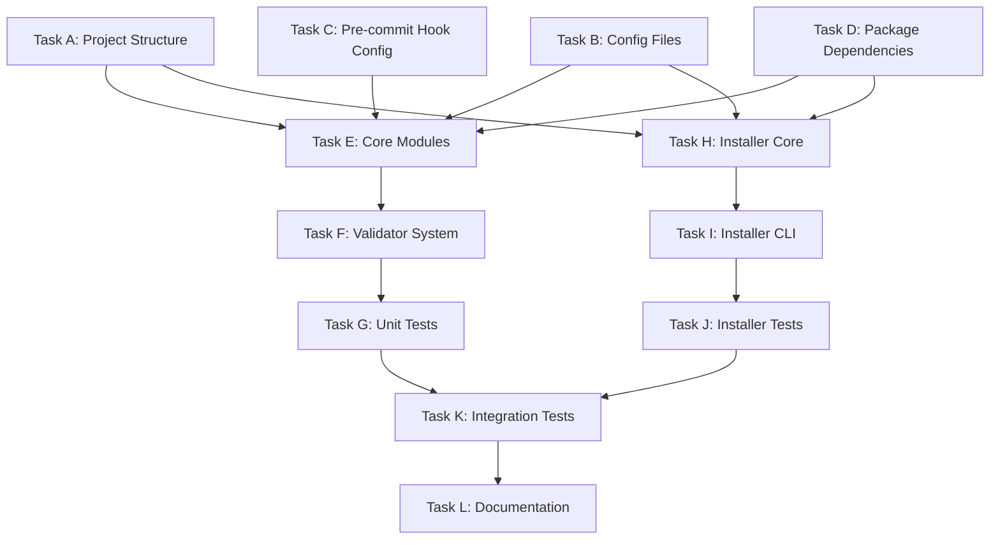

# Implementation Plan: commit-polish

## Overview

This plan coordinates AI agent swarm execution to implement commit-polish, a two-package pre-commit hook system that automatically rewrites git commit messages using local LLMs via LiteLLM. Tasks are organized by dependency-based priorities enabling massively parallel execution.

**Architecture Context**:
- Package 1: `commit-polish` (hook runtime) - lightweight, implements first
- Package 2: `commit-polish-installer` (setup tool) - heavy dependencies, implements second
- Monorepo structure with uv workspace
- Python 3.11+ required, LiteLLM for API abstraction, llamafile for local inference

## Dependency Graph

## Parallelization Summary

- **Priority 1**: 4 tasks can run in parallel (no dependencies)
- **Priority 2**: Task E enables Tasks F→G (3 tasks total, partial parallelization)
- **Priority 3**: Task H enables Tasks I→J (3 tasks total, sequential)
- **Priority 4**: Task K enables Task L (2 tasks total, sequential)

---

## Priority 1: Foundation (No Dependencies)

Tasks in this priority can execute in parallel with no coordination required.

### Task A: Initialize Project Structure

**Dependencies**: None
**Priority**: 1 (Foundational)
**Complexity**: Low

**Acceptance Criteria**:
1. Directory structure created:
   - `packages/commit-polish/src/commit_polish/`
   - `packages/commit-polish/tests/`
   - `packages/commit-polish-installer/src/commit_polish_installer/`
   - `packages/commit-polish-installer/tests/`
   - `references/` (already exists)
2. All directories contain `__init__.py` files where appropriate
3. Structure matches architecture specification in architecture.md
4. No files with content yet (just directory structure)
5. Verification command succeeds: `find packages/ -type d`

**Required Inputs**:
- Architecture document at `/home/ubuntulinuxqa2/repos/commit-polish/architecture.md`
- CLAUDE.md package structure specifications

**Expected Outputs**:
- `packages/commit-polish/src/commit_polish/__init__.py`
- `packages/commit-polish/tests/__init__.py`
- `packages/commit-polish-installer/src/commit_polish_installer/__init__.py`
- `packages/commit-polish-installer/tests/__init__.py`
- Subdirectories: `packages/commit-polish/src/commit_polish/validators/`
- Subdirectories: `packages/commit-polish/tests/test_validators/`

**Can Parallelize With**: Task B (Config Files), Task C (Pre-commit Hook Config), Task D (Package Dependencies)
**Reason**: Operates on directory structure only, no file conflicts

**Verification Steps**:
1. Run `find packages/ -type d` - should show all expected directories
2. Run `find packages/ -name '__init__.py'` - should show all __init__.py files
3. Verify directory tree matches architecture.md specifications
4. No syntax errors when importing empty packages

---

### Task B: Create Configuration Files

**Dependencies**: None
**Priority**: 1 (Foundational)
**Complexity**: Low

**Acceptance Criteria**:
1. Root `pyproject.toml` created with uv workspace configuration
2. Workspace members configured: `packages/*`
3. Ruff configuration with line-length=100, target-version="py311"
4. Mypy configuration with strict=true, python_version="3.11"
5. `.gitignore` created with Python patterns (\_\_pycache\_\_, *.pyc, .pytest_cache, .mypy_cache, dist/, build/)
6. Validation: `uv sync` runs without errors (will show no dependencies yet)

**Required Inputs**:
- Architecture document section: "Workspace Configuration"
- Python 3.11+ requirement
- Tool specifications from architecture.md

**Expected Outputs**:
- `/home/ubuntulinuxqa2/repos/commit-polish/pyproject.toml` (root workspace)
- `/home/ubuntulinuxqa2/repos/commit-polish/.gitignore`
- Configuration includes:
  - `[tool.uv.workspace]` with members
  - `[tool.ruff]` with linting rules
  - `[tool.mypy]` with type checking rules

**Can Parallelize With**: Task A (Project Structure), Task C (Pre-commit Hook Config), Task D (Package Dependencies)
**Reason**: Operates on root configuration files, no conflicts with other tasks

**Verification Steps**:
1. Run `uv sync` - should complete without errors
2. Validate TOML syntax with `tomlkit.load()`
3. Verify workspace members are recognized
4. Check ruff config: `uv run ruff --version` should work
5. Check mypy config: `uv run mypy --version` should work

---

### Task C: Create Pre-commit Hook Configuration

**Dependencies**: None
**Priority**: 1 (Foundational)
**Complexity**: Low

**Acceptance Criteria**:
1. `.pre-commit-hooks.yaml` created in `packages/commit-polish/`
2. Hook ID: `commit-polish`
3. Stage: `[prepare-commit-msg]` (CRITICAL - not commit-msg)
4. Entry point: `commit-polish`
5. Settings: `pass_filenames: false`, `always_run: true`
6. Language: `python`
7. YAML syntax validates successfully

**Required Inputs**:
- Architecture document section: "Pre-commit Hook Configuration"
- CLAUDE.md critical specifications about prepare-commit-msg stage

**Expected Outputs**:
- `/home/ubuntulinuxqa2/repos/commit-polish/packages/commit-polish/.pre-commit-hooks.yaml`
- File content matches architecture specification exactly

**Can Parallelize With**: Task A (Project Structure), Task B (Config Files), Task D (Package Dependencies)
**Reason**: Operates on commit-polish package config only, no conflicts

**Verification Steps**:
1. Validate YAML syntax: `python -c "import yaml; yaml.safe_load(open('.pre-commit-hooks.yaml'))"`
2. Verify stages contains `prepare-commit-msg` (not `commit-msg`)
3. Verify `pass_filenames: false` is set
4. Verify `always_run: true` is set
5. Check entry point matches script name in pyproject.toml (will be created in Task D)

---

### Task D: Create Package Dependency Files

**Dependencies**: None
**Priority**: 1 (Foundational)
**Complexity**: Medium

**Acceptance Criteria**:
1. `packages/commit-polish/pyproject.toml` created with:
   - name: "commit-polish"
   - requires-python: ">=3.11"
   - dependencies: ["litellm>=1.0.0", "tomlkit>=0.13.0"]
   - dev dependencies: pytest, pytest-asyncio, pytest-mock, ruff, mypy
   - script entry point: `commit-polish = "commit_polish.hook:main"`
   - build-system with uv_build
2. `packages/commit-polish-installer/pyproject.toml` created with:
   - name: "commit-polish-installer"
   - requires-python: ">=3.11"
   - dependencies: ["typer>=0.9.0", "tomlkit>=0.13.0", "rich>=13.0.0", "httpx>=0.25.0"]
   - dev dependencies: pytest, ruff, mypy
   - script entry point: `commit-polish-install = "commit_polish_installer.cli:app"`
   - build-system with uv_build
3. Both files validate as correct TOML
4. `uv sync` completes successfully and installs all dependencies

**Required Inputs**:
- Architecture document sections: "Dependencies" for both packages
- CLAUDE.md dependency specifications
- Python 3.11+ requirement

**Expected Outputs**:
- `/home/ubuntulinuxqa2/repos/commit-polish/packages/commit-polish/pyproject.toml`
- `/home/ubuntulinuxqa2/repos/commit-polish/packages/commit-polish-installer/pyproject.toml`
- `uv.lock` file generated after `uv sync`

**Can Parallelize With**: Task A (Project Structure), Task B (Config Files), Task C (Pre-commit Hook Config)
**Reason**: Operates on package-specific pyproject.toml files, different locations

**Verification Steps**:
1. Validate TOML syntax for both files
2. Run `uv sync` from workspace root - should install all dependencies
3. Verify package recognition: `uv tree` should show both packages and their dependencies
4. Check dependencies installed: `uv run pip list` should show litellm, typer, tomlkit, rich, httpx, pytest, ruff, mypy
5. No dependency conflicts reported

---

## SYNC CHECKPOINT 1: Foundation Convergence

**Convergence Point**: Task A, Task B, Task C, Task D must all complete

**Quality Gates**:
- [ ] Project structure exists with all required directories
- [ ] All configuration files are valid TOML/YAML
- [ ] `uv sync` completes without errors
- [ ] All dependencies installed correctly
- [ ] Pre-commit hook configuration uses `prepare-commit-msg` stage (not `commit-msg`)
- [ ] Workspace recognizes both packages
- [ ] No syntax errors in any configuration file
- [ ] `.gitignore` includes necessary Python patterns

**Review Questions**:
1. Does directory structure match architecture.md specification exactly?
2. Are all critical configuration values correct (prepare-commit-msg, llamafile/ prefix, port 8080)?
3. Are dependency versions compatible and available?
4. Is workspace configuration recognizing both packages?
5. Are there any missing directories or files from architecture specification?

**Reflection Phase**:
- Orchestrator reviews foundational setup
- Validates consistency between package structures
- Verifies configuration matches CLAUDE.md critical requirements
- Checks for common pitfalls (commit-msg vs prepare-commit-msg, port 8000 vs 8080)
- User approves foundation before core development begins

**Proceed to Priority 2 only after explicit approval**

---

## Priority 2: Core Hook Implementation (Depends on Priority 1)

Tasks in this priority depend on Priority 1 completion. Some can run in parallel.

### Task E: Implement commit-polish Core Modules

**Dependencies**: Task A (Directory structure), Task B (Root config), Task D (Package dependencies)
**Priority**: 2 (Core)
**Complexity**: High

**Acceptance Criteria**:
1. `config.py` implemented:
   - `load_config()` function using `tomlkit.load()` with text mode
   - `Config`, `AIConfig`, `LlamafileConfig`, `ValidationConfig` dataclasses
   - `get_config_file()` returns XDG-compliant path: `~/.config/commit-polish/config.toml`
   - Validates required fields (model starts with `llamafile/`, temperature 0.0-1.0, etc.)
   - Comprehensive docstrings with type hints
2. `ai_service.py` implemented:
   - `AIService` class with `complete()` and `acomplete()` methods
   - `CompletionRequest` and `CompletionResponse` dataclasses
   - LiteLLM integration with `llamafile/` prefix routing
   - API base: `http://127.0.0.1:8080/v1` (port 8080, includes /v1)
   - Exception handling for `litellm.APIConnectionError`, `litellm.Timeout`, `litellm.BadRequestError`
   - CRITICAL: Import exceptions from `litellm` NOT `litellm.exceptions`
3. `hook.py` implemented:
   - `main()` function with correct signature and return codes (0=success, 1=error)
   - Reads commit message from `sys.argv[1]` file path
   - Delegates to MessageRewriter
   - Writes rewritten message back to file
   - Error handling with clear messages (config missing, llamafile not running)
4. `message_rewriter.py` implemented:
   - `MessageRewriter` class with `rewrite_message()` method
   - `RewriteResult` dataclass with success, message, attempts, validation_errors
   - Orchestrates LLM generation with validation feedback loop
   - Max retries logic (configurable, default 3)
   - Default system prompt for Conventional Commits format
5. All modules have:
   - Complete type hints (pass `mypy --strict`)
   - Comprehensive docstrings (Google style)
   - No placeholder code or TODOs
   - Error handling for common failure modes
6. Linting passes: `uv run ruff check src/`
7. Type checking passes: `uv run mypy src/`

**Required Inputs**:
- Architecture document sections: "Package 1: commit-polish" component specifications
- CLAUDE.md technical specifications (LiteLLM integration, exception handling)
- Default system prompt from architecture.md
- Configuration schema from architecture.md

**Expected Outputs**:
- `/home/ubuntulinuxqa2/repos/commit-polish/packages/commit-polish/src/commit_polish/config.py`
- `/home/ubuntulinuxqa2/repos/commit-polish/packages/commit-polish/src/commit_polish/ai_service.py`
- `/home/ubuntulinuxqa2/repos/commit-polish/packages/commit-polish/src/commit_polish/hook.py`
- `/home/ubuntulinuxqa2/repos/commit-polish/packages/commit-polish/src/commit_polish/message_rewriter.py`
- All files fully implemented with production-ready code

**Can Parallelize With**: None - This task must complete before Task F
**Reason**: Validator system depends on these core modules

**Verification Steps**:
1. Type check: `cd packages/commit-polish && uv run mypy src/`
2. Lint: `cd packages/commit-polish && uv run ruff check src/`
3. Format check: `cd packages/commit-polish && uv run ruff format --check src/`
4. Import test: `uv run python -c "from commit_polish import config, ai_service, hook, message_rewriter"`
5. Verify exception imports: `uv run python -c "from litellm import APIConnectionError, Timeout, BadRequestError"`
6. Check for critical pitfalls:
   - No imports from `litellm.exceptions`
   - API base uses port 8080 (not 8000)
   - Config loader uses text mode ('r') for tomlkit
   - Model names require `llamafile/` prefix in validation

---

### Task F: Implement commit-polish Validator System

**Dependencies**: Task E (Core modules must exist)
**Priority**: 2 (Core)
**Complexity**: High

**Acceptance Criteria**:
1. `validators/base.py` implemented:
   - `Validator` Protocol with `validate()` and `get_system_prompt_additions()` methods
   - Type hints using `typing.Protocol`
2. `validators/detector.py` implemented:
   - `detect_validator()` function with auto-detection logic
   - Searches for commitlint configs (commitlint.config.js, .commitlintrc, .commitlintrc.json, etc.)
   - Searches for semantic-release config (release.config.js)
   - Searches for commitizen config (.cz.json, .czrc)
   - Returns appropriate validator instance or None
3. `validators/commitlint.py` implemented:
   - `CommitlintValidator` class implementing `Validator` protocol
   - `COMMITLINT_CONFIG_FILES` constant with all config filename variants
   - `validate()` method runs `npx commitlint` subprocess and parses output
   - `get_system_prompt_additions()` extracts allowed types from config
   - Error handling for missing commitlint or invalid config
4. `validators/semantic_release.py` implemented (basic):
   - `SemanticReleaseValidator` class implementing `Validator` protocol
   - Extracts commit types from semantic-release configuration
   - Basic validation support
5. All validators have:
   - Complete type hints
   - Comprehensive docstrings
   - Error handling for subprocess failures
   - No shell=True in subprocess calls (security requirement)
6. Linting and type checking pass

**Required Inputs**:
- Architecture document section: "validators/ (Validator Integration)"
- Task E outputs (core modules for integration)
- Validator configuration file examples from references/commitlint.md

**Expected Outputs**:
- `/home/ubuntulinuxqa2/repos/commit-polish/packages/commit-polish/src/commit_polish/validators/__init__.py`
- `/home/ubuntulinuxqa2/repos/commit-polish/packages/commit-polish/src/commit_polish/validators/base.py`
- `/home/ubuntulinuxqa2/repos/commit-polish/packages/commit-polish/src/commit_polish/validators/detector.py`
- `/home/ubuntulinuxqa2/repos/commit-polish/packages/commit-polish/src/commit_polish/validators/commitlint.py`
- `/home/ubuntulinuxqa2/repos/commit-polish/packages/commit-polish/src/commit_polish/validators/semantic_release.py`

**Can Parallelize With**: None - Task G (Unit Tests) depends on this
**Reason**: Tests need validator system to be complete

**Verification Steps**:
1. Type check validators: `uv run mypy src/commit_polish/validators/`
2. Lint validators: `uv run ruff check src/commit_polish/validators/`
3. Import test: `uv run python -c "from commit_polish.validators import detect_validator, Validator"`
4. Verify no shell=True usage: `grep -r "shell=True" src/commit_polish/validators/` should return empty
5. Check Protocol implementation: `uv run python -c "from commit_polish.validators.commitlint import CommitlintValidator; from commit_polish.validators.base import Validator; assert isinstance(CommitlintValidator(), Validator)"`

---

### Task G: Implement commit-polish Unit Tests

**Dependencies**: Task E (Core modules), Task F (Validator system)
**Priority**: 2 (Core)
**Complexity**: High

**Acceptance Criteria**:
1. `tests/conftest.py` with shared fixtures:
   - Mock config fixture
   - Mock LiteLLM response fixture
   - Temporary file fixtures for commit messages
   - Mock validator fixtures
2. `tests/test_config.py` with tests for:
   - Loading valid TOML configuration
   - Handling missing config file
   - Handling invalid TOML syntax
   - Validating config field requirements (model prefix, temperature range, etc.)
   - XDG path resolution
3. `tests/test_ai_service.py` with tests for:
   - Successful completion request
   - APIConnectionError handling (llamafile not running)
   - Timeout handling
   - BadRequestError handling
   - Response parsing
   - Mock LiteLLM (use pytest-mock)
4. `tests/test_hook.py` with tests for:
   - Reading commit message from file
   - Writing rewritten message to file
   - Return code 0 on success
   - Return code 1 on errors (config missing, llamafile down, etc.)
   - sys.argv[1] parsing
5. `tests/test_message_rewriter.py` with tests for:
   - Message generation without validator
   - Message generation with validator (valid)
   - Message generation with validator (invalid, retries)
   - Max retries reached (returns last attempt)
   - Validation error feedback to LLM
6. `tests/test_validators/test_detector.py` with tests for:
   - Commitlint config detection (all file variants)
   - Semantic-release config detection
   - No config found (returns None)
7. `tests/test_validators/test_commitlint.py` with tests for:
   - Validation success (valid message)
   - Validation failure (invalid message with error parsing)
   - Commitlint not installed handling
   - System prompt additions extraction
8. All tests:
   - Use pytest with modern patterns
   - Have type hints with pytest fixtures typed
   - Follow AAA pattern (Arrange-Act-Assert)
   - Use pytest-mock for mocking (not unittest.mock)
   - Coverage >80% for tested modules
9. Test suite passes: `uv run pytest -v`
10. Coverage report generated: `uv run pytest --cov=commit_polish --cov-report=term`

**Required Inputs**:
- Task E outputs (core modules to test)
- Task F outputs (validator system to test)
- Architecture document section: "Testing Architecture"

**Expected Outputs**:
- `/home/ubuntulinuxqa2/repos/commit-polish/packages/commit-polish/tests/conftest.py`
- `/home/ubuntulinuxqa2/repos/commit-polish/packages/commit-polish/tests/test_config.py`
- `/home/ubuntulinuxqa2/repos/commit-polish/packages/commit-polish/tests/test_ai_service.py`
- `/home/ubuntulinuxqa2/repos/commit-polish/packages/commit-polish/tests/test_hook.py`
- `/home/ubuntulinuxqa2/repos/commit-polish/packages/commit-polish/tests/test_message_rewriter.py`
- `/home/ubuntulinuxqa2/repos/commit-polish/packages/commit-polish/tests/test_validators/test_detector.py`
- `/home/ubuntulinuxqa2/repos/commit-polish/packages/commit-polish/tests/test_validators/test_commitlint.py`

**Can Parallelize With**: None - Completes Priority 2
**Reason**: Final task in this priority level

**Verification Steps**:
1. Run all tests: `cd packages/commit-polish && uv run pytest tests/ -v`
2. Check coverage: `cd packages/commit-polish && uv run pytest --cov=commit_polish tests/ --cov-report=term`
3. Verify coverage >80%: Check coverage report output
4. Run specific test files to verify each module
5. Check for flaky tests: Run suite 3 times, all should pass
6. Verify no tests marked with `@pytest.mark.skip`

---

## SYNC CHECKPOINT 2: Hook Package Completion

**Convergence Point**: Task E, Task F, Task G must all complete

**Quality Gates**:
- [ ] All core modules fully implemented with type hints and docstrings
- [ ] Validator system implements Protocol correctly
- [ ] All tests pass: `uv run pytest -v`
- [ ] Coverage >80% for all modules
- [ ] Type checking passes: `uv run mypy src/`
- [ ] Linting passes: `uv run ruff check src/`
- [ ] No TODO or FIXME comments in code
- [ ] Critical specifications verified:
  - [ ] prepare-commit-msg stage (not commit-msg)
  - [ ] llamafile/ prefix required for models
  - [ ] Port 8080 (not 8000) in API base
  - [ ] Exceptions imported from `litellm` (not `litellm.exceptions`)
  - [ ] Config uses text mode ('r') for tomlkit
  - [ ] No shell=True in subprocess calls

**Review Questions**:
1. Does hook.py correctly parse sys.argv[1] for commit message file path?
2. Does ai_service.py use correct API base (port 8080, includes /v1)?
3. Does message_rewriter.py implement validation feedback loop correctly?
4. Do validators run subprocess commands safely (no shell=True)?
5. Are all tests realistic and testing actual behavior (not just mocks)?
6. Is error handling appropriate for each failure mode?

**Reflection Phase**:
- Orchestrator reviews hook package implementation
- Verifies integration between core modules and validator system
- Tests hook manually with mock commit message file
- Validates all critical pitfalls have been avoided
- User approves hook package before proceeding to installer

**Proceed to Priority 3 only after explicit approval**

---

## Priority 3: Installer Implementation (Depends on Priority 1)

Tasks in this priority depend on Priority 1 completion but are independent of Priority 2.

### Task H: Implement commit-polish-installer Core Modules

**Dependencies**: Task A (Directory structure), Task B (Root config), Task D (Package dependencies)
**Priority**: 3 (Installer Core)
**Complexity**: High

**Acceptance Criteria**:
1. `paths.py` implemented:
   - `get_config_dir()` returns `~/.config/commit-polish` (respects XDG_CONFIG_HOME)
   - `get_config_file()` returns `~/.config/commit-polish/config.toml`
   - `get_data_dir()` returns `~/.local/share/commit-polish` (respects XDG_DATA_HOME)
   - `get_models_dir()` returns `~/.local/share/commit-polish/models`
   - `get_cache_dir()` returns `~/.cache/commit-polish` (respects XDG_CACHE_HOME)
   - `ensure_directories()` creates all directories with parents
   - All functions handle environment variable overrides correctly
2. `llamafile_installer.py` implemented:
   - `LlamafileConfig` and `ModelConfig` dataclasses
   - `LlamafileInstaller.install_llamafile()` method:
     - Downloads from `https://github.com/mozilla-ai/llamafile/releases/download/0.9.3/llamafile-0.9.3`
     - Writes to `~/.local/bin/llamafile`
     - chmod 755 (makes executable)
     - Progress reporting with Rich
   - `LlamafileInstaller.install_model()` method:
     - Downloads Gemma 3 3B Q4_K_M from Hugging Face
     - URL: `https://huggingface.co/Mozilla/gemma-3-3b-it-gguf/resolve/main/gemma-3-3b-it-Q4_K_M.gguf`
     - Writes to `~/.local/share/commit-polish/models/gemma-3-3b.gguf`
     - Verifies file size (~2GB)
     - Progress reporting
   - Error handling for network failures with retry logic
   - Uses httpx for downloads
3. `config_generator.py` implemented:
   - `ConfigGenerator.generate_config()` method
   - Creates TOML config with `tomlkit.dump()`
   - Opens file in text mode ('w')
   - Generated config includes:
     - `[ai]` section with model="llamafile/gemma-3-3b", temperature=0.3, max_tokens=200
     - `[llamafile]` section with paths
     - `[validation]` section with auto_detect=true, max_retries=3
   - Creates parent directories if needed
4. `hook_installer.py` implemented:
   - `HookInstaller.install_hook()` method:
     - Verifies pre-commit is installed
     - Runs `pre-commit install --hook-type prepare-commit-msg`
     - Uses subprocess without shell=True
   - `HookInstaller.verify_installation()` method:
     - Checks `.git/hooks/prepare-commit-msg` exists
     - Verifies file contains "pre-commit" reference
5. `server_manager.py` implemented:
   - `ServerManager.start_server()` method:
     - Command: `./llamafile --server -m model.gguf --nobrowser --port 8080 --host 127.0.0.1`
     - Runs in background if requested
     - Returns process handle
   - `ServerManager.stop_server()` method:
     - Finds process by port 8080 and kills
   - `ServerManager.check_status()` method:
     - Curls http://localhost:8080/health or /v1/models
     - Returns True if responding
6. All modules have complete type hints, docstrings, error handling
7. Linting and type checking pass

**Required Inputs**:
- Architecture document sections: "Package 2: commit-polish-installer" component specifications
- CLAUDE.md critical URLs and versions
- XDG Base Directory specification from references/

**Expected Outputs**:
- `/home/ubuntulinuxqa2/repos/commit-polish/packages/commit-polish-installer/src/commit_polish_installer/paths.py`
- `/home/ubuntulinuxqa2/repos/commit-polish/packages/commit-polish-installer/src/commit_polish_installer/llamafile_installer.py`
- `/home/ubuntulinuxqa2/repos/commit-polish/packages/commit-polish-installer/src/commit_polish_installer/config_generator.py`
- `/home/ubuntulinuxqa2/repos/commit-polish/packages/commit-polish-installer/src/commit_polish_installer/hook_installer.py`
- `/home/ubuntulinuxqa2/repos/commit-polish/packages/commit-polish-installer/src/commit_polish_installer/server_manager.py`

**Can Parallelize With**: None - Task I depends on this
**Reason**: CLI needs core modules to orchestrate

**Verification Steps**:
1. Type check: `cd packages/commit-polish-installer && uv run mypy src/`
2. Lint: `cd packages/commit-polish-installer && uv run ruff check src/`
3. Import test: `uv run python -c "from commit_polish_installer import paths, llamafile_installer, config_generator, hook_installer, server_manager"`
4. Test XDG paths: `uv run python -c "from commit_polish_installer.paths import get_config_file; print(get_config_file())"`
5. Verify URLs are correct (0.9.3 for llamafile, Gemma 3 3B Q4_K_M for model)
6. Verify port 8080 (not 8000) in server_manager
7. Verify no shell=True in subprocess calls
8. Check tomlkit usage: Text mode ('w') is used with `tomlkit.dump()`

---

### Task I: Implement commit-polish-installer CLI

**Dependencies**: Task H (Installer core modules)
**Priority**: 3 (Installer CLI)
**Complexity**: Medium

**Acceptance Criteria**:
1. `cli.py` implemented with Typer:
   - `app = typer.Typer()` instance created
   - `install()` command implemented:
     - Options: --model (default="gemma-3-3b"), --start-server (default=True), --dry-run (default=False)
     - Orchestrates: llamafile download → model download → config generation → hook installation → optional server start
     - Rich progress reporting for each step
     - Error handling with actionable messages
   - `server()` command implemented:
     - Argument: action (start|stop|status)
     - Delegates to ServerManager
     - Rich status output
   - `config()` command implemented:
     - Options: --show, --edit
     - Shows current config or opens in $EDITOR
2. All commands have:
   - Complete help text
   - Type hints using Annotated from typing_extensions
   - Error handling with Rich error panels
   - Dry-run support for install command
3. Entry point registered in pyproject.toml: `commit-polish-install = "commit_polish_installer.cli:app"`
4. CLI can be invoked: `uv run --package commit-polish-installer commit-polish-install --help`

**Required Inputs**:
- Task H outputs (core installer modules)
- Architecture document section: "cli.py (CLI Interface)"
- Typer and Rich documentation from references/

**Expected Outputs**:
- `/home/ubuntulinuxqa2/repos/commit-polish/packages/commit-polish-installer/src/commit_polish_installer/cli.py`

**Can Parallelize With**: None - Task J depends on this
**Reason**: Tests need CLI implementation

**Verification Steps**:
1. Type check CLI: `uv run mypy src/commit_polish_installer/cli.py`
2. Lint CLI: `uv run ruff check src/commit_polish_installer/cli.py`
3. Test help: `uv run --package commit-polish-installer commit-polish-install --help`
4. Test install help: `uv run --package commit-polish-installer commit-polish-install install --help`
5. Test dry-run: `uv run --package commit-polish-installer commit-polish-install install --dry-run`
6. Verify Rich formatting displays correctly

---

### Task J: Implement commit-polish-installer Tests

**Dependencies**: Task H (Core modules), Task I (CLI)
**Priority**: 3 (Installer Tests)
**Complexity**: High

**Acceptance Criteria**:
1. `tests/conftest.py` with shared fixtures:
   - Temporary directory fixtures
   - Mock httpx fixtures for downloads
   - Mock subprocess fixtures for pre-commit/llamafile commands
2. `tests/test_paths.py` with tests for:
   - XDG path resolution (config, data, cache)
   - Environment variable override (XDG_CONFIG_HOME, XDG_DATA_HOME, XDG_CACHE_HOME)
   - Directory creation
3. `tests/test_llamafile_installer.py` with tests for:
   - Llamafile download (mock httpx)
   - Model download (mock httpx)
   - File permissions (chmod 755)
   - Retry logic on network failures
   - File size verification
4. `tests/test_config_generator.py` with tests for:
   - Config generation with correct structure
   - TOML validation of generated config
   - Text mode used ('w')
   - Parent directory creation
5. `tests/test_hook_installer.py` with tests for:
   - pre-commit installation command (mock subprocess)
   - Installation verification
   - pre-commit not installed handling
6. `tests/test_cli.py` with tests for:
   - Install command with --dry-run
   - Server command (start/stop/status)
   - Config command (show/edit)
   - Help text rendering
   - Error handling with Rich panels
7. All tests pass: `uv run pytest -v`
8. Coverage >70% for installer modules

**Required Inputs**:
- Task H outputs (core modules to test)
- Task I outputs (CLI to test)
- Architecture document section: "Testing Architecture"

**Expected Outputs**:
- `/home/ubuntulinuxqa2/repos/commit-polish/packages/commit-polish-installer/tests/conftest.py`
- `/home/ubuntulinuxqa2/repos/commit-polish/packages/commit-polish-installer/tests/test_paths.py`
- `/home/ubuntulinuxqa2/repos/commit-polish/packages/commit-polish-installer/tests/test_llamafile_installer.py`
- `/home/ubuntulinuxqa2/repos/commit-polish/packages/commit-polish-installer/tests/test_config_generator.py`
- `/home/ubuntulinuxqa2/repos/commit-polish/packages/commit-polish-installer/tests/test_hook_installer.py`
- `/home/ubuntulinuxqa2/repos/commit-polish/packages/commit-polish-installer/tests/test_cli.py`

**Can Parallelize With**: None - Completes Priority 3
**Reason**: Final task in this priority level

**Verification Steps**:
1. Run all tests: `cd packages/commit-polish-installer && uv run pytest tests/ -v`
2. Check coverage: `cd packages/commit-polish-installer && uv run pytest --cov=commit_polish_installer tests/ --cov-report=term`
3. Verify coverage >70%
4. Test httpx mocking is realistic
5. Test subprocess mocking captures correct commands
6. Check for flaky tests: Run suite 3 times

---

## SYNC CHECKPOINT 3: Installer Package Completion

**Convergence Point**: Task H, Task I, Task J must all complete

**Quality Gates**:
- [ ] All installer core modules fully implemented
- [ ] CLI commands functional with Rich formatting
- [ ] All tests pass: `uv run pytest -v`
- [ ] Coverage >70% for installer modules
- [ ] Type checking passes: `uv run mypy src/`
- [ ] Linting passes: `uv run ruff check src/`
- [ ] No TODO or FIXME comments in code
- [ ] Critical specifications verified:
  - [ ] Llamafile version 0.9.3
  - [ ] Gemma 3 3B Q4_K_M model
  - [ ] Port 8080 for server (not 8000)
  - [ ] XDG-compliant paths
  - [ ] prepare-commit-msg hook type
  - [ ] No shell=True in subprocess calls
  - [ ] Text mode ('w') for TOML files with tomlkit

**Review Questions**:
1. Does installer download correct llamafile version (0.9.3)?
2. Does installer download correct model (Gemma 3 3B Q4_K_M)?
3. Does config_generator create valid TOML with llamafile/ prefix?
4. Does hook_installer use --hook-type prepare-commit-msg?
5. Does server_manager start server on port 8080?
6. Are all XDG paths implemented correctly with environment variable support?
7. Is error handling appropriate with actionable user messages?

**Reflection Phase**:
- Orchestrator reviews installer package implementation
- Tests install command with --dry-run to verify orchestration
- Validates all URLs and versions are correct
- Checks for common pitfalls in installer logic
- User approves installer package before proceeding to integration testing

**Proceed to Priority 4 only after explicit approval**

---

## Priority 4: Integration and Documentation (Depends on Priorities 2 and 3)

Final tasks requiring both packages to be complete.

### Task K: Implement Integration Tests

**Dependencies**: Task G (Hook tests complete), Task J (Installer tests complete)
**Priority**: 4 (Integration)
**Complexity**: High

**Acceptance Criteria**:
1. `packages/commit-polish/tests/integration/` directory created
2. Integration test files:
   - `test_end_to_end_hook.py`: Tests full commit message rewriting flow
     - Creates temporary git repo
     - Creates mock config file
     - Mocks LiteLLM responses
     - Invokes hook with commit message file
     - Verifies rewritten message
   - `test_validator_integration.py`: Tests hook with real validator configs
     - Creates commitlint.config.js in test repo
     - Tests validation loop with valid/invalid messages
     - Verifies retry logic
   - `test_hook_without_config.py`: Tests error handling when config missing
     - Verifies appropriate error message
     - Verifies exit code 1
3. `packages/commit-polish-installer/tests/integration/` directory created
4. Integration test files:
   - `test_install_flow.py`: Tests full installation process
     - Mocks httpx downloads
     - Mocks subprocess calls (pre-commit install)
     - Verifies all files created in correct locations
     - Verifies config file contents
   - `test_dry_run.py`: Tests dry-run mode
     - Verifies no files actually created
     - Verifies progress messages displayed
5. All integration tests:
   - Use temporary directories (pytest tmp_path fixture)
   - Clean up after themselves
   - Can run independently in any order
   - Pass consistently: `uv run pytest tests/integration/ -v`
6. Security verification test:
   - Grep for shell=True across entire codebase (should find none)
   - Verify all subprocess calls use list arguments
7. Cross-package integration test:
   - Tests that installer-generated config can be loaded by hook
   - Verifies config structure compatibility

**Required Inputs**:
- Task E, F outputs (hook implementation)
- Task H, I outputs (installer implementation)
- Architecture document section: "Testing Architecture"

**Expected Outputs**:
- `/home/ubuntulinuxqa2/repos/commit-polish/packages/commit-polish/tests/integration/test_end_to_end_hook.py`
- `/home/ubuntulinuxqa2/repos/commit-polish/packages/commit-polish/tests/integration/test_validator_integration.py`
- `/home/ubuntulinuxqa2/repos/commit-polish/packages/commit-polish/tests/integration/test_hook_without_config.py`
- `/home/ubuntulinuxqa2/repos/commit-polish/packages/commit-polish-installer/tests/integration/test_install_flow.py`
- `/home/ubuntulinuxqa2/repos/commit-polish/packages/commit-polish-installer/tests/integration/test_dry_run.py`
- Security verification passing

**Can Parallelize With**: Task L (Documentation) can start while integration tests are being written
**Reason**: Documentation doesn't depend on test completion, only on code existence

**Verification Steps**:
1. Run hook integration tests: `cd packages/commit-polish && uv run pytest tests/integration/ -v`
2. Run installer integration tests: `cd packages/commit-polish-installer && uv run pytest tests/integration/ -v`
3. Run all tests (unit + integration): `uv run pytest -v` from workspace root
4. Security check: `grep -r "shell=True" packages/` should return empty
5. Verify tests are independent: Run tests in random order with pytest-random-order
6. Check integration test cleanup: No leftover files in /tmp after tests

---

### Task L: Create Documentation

**Dependencies**: Task K (Integration tests verify system works)
**Priority**: 4 (Documentation)
**Complexity**: Medium

**Acceptance Criteria**:
1. `README.md` created at workspace root with:
   - Project overview and features
   - Installation instructions (uvx, uv tool install, pipx)
   - Quick start guide
   - Configuration documentation (with example config.toml)
   - Usage examples
   - Troubleshooting section (common errors and solutions)
   - Architecture diagram reference
   - Links to architecture.md and CLAUDE.md
2. `packages/commit-polish/README.md` created with:
   - Hook-specific documentation
   - API documentation for modules
   - Configuration schema
   - Pre-commit hook setup instructions
   - Manual testing instructions
3. `packages/commit-polish-installer/README.md` created with:
   - Installer-specific documentation
   - CLI command reference
   - Server management guide
   - Uninstallation instructions
4. All documentation:
   - Uses code blocks with language specifiers
   - Has working examples (verified manually)
   - Links are valid (no 404s)
   - Markdown linting passes: `markdownlint-cli2 "**/*.md"`
5. Documentation covers common pitfalls from architecture.md:
   - prepare-commit-msg vs commit-msg
   - llamafile/ prefix requirement
   - Port 8080 vs 8000
   - Exception import location
   - Text mode for TOML files with tomlkit

**Required Inputs**:
- All implemented code from Priority 2 and 3
- Architecture document (for reference and diagrams)
- CLAUDE.md (for development workflow)
- Common pitfalls section from architecture.md

**Expected Outputs**:
- `/home/ubuntulinuxqa2/repos/commit-polish/README.md`
- `/home/ubuntulinuxqa2/repos/commit-polish/packages/commit-polish/README.md`
- `/home/ubuntulinuxqa2/repos/commit-polish/packages/commit-polish-installer/README.md`
- All markdown files pass linting

**Can Parallelize With**: None - Final task in implementation plan
**Reason**: Last priority task

**Verification Steps**:
1. Validate markdown: `markdownlint-cli2 "**/*.md"` (install if needed: `npm install -g markdownlint-cli2`)
2. Check all links: Use markdown-link-check or manual verification
3. Verify code examples are accurate (check against actual code)
4. Test installation instructions manually
5. Verify troubleshooting section covers common errors
6. Ensure README.md has clear project value proposition

---

## SYNC CHECKPOINT 4: Project Completion

**Convergence Point**: Task K (Integration tests), Task L (Documentation) must complete

**Quality Gates**:
- [ ] All unit tests pass: `cd packages/commit-polish && uv run pytest -v`
- [ ] All installer tests pass: `cd packages/commit-polish-installer && uv run pytest -v`
- [ ] All integration tests pass for both packages
- [ ] Coverage >80% for hook package, >70% for installer package
- [ ] Type checking passes for both packages: `uv run mypy .`
- [ ] Linting passes for both packages: `uv run ruff check .`
- [ ] Security check passes: No shell=True found in codebase
- [ ] Documentation is complete and accurate
- [ ] All markdown files pass linting
- [ ] Common pitfalls verified avoided:
  - [ ] All config files use prepare-commit-msg (not commit-msg)
  - [ ] All model references use llamafile/ prefix
  - [ ] All API bases use port 8080 (not 8000)
  - [ ] All exceptions imported from litellm (not litellm.exceptions)
  - [ ] All TOML operations use text mode ('r'/'w') with tomlkit
  - [ ] No subprocess calls use shell=True

**Review Questions**:
1. Can orchestrator successfully run end-to-end integration test?
2. Does generated config from installer work correctly with hook?
3. Are all error messages actionable for users?
4. Is documentation clear enough for external users?
5. Have all critical specifications been verified in code?
6. Are there any remaining TODOs or FIXMEs?
7. Is the codebase ready for manual testing with real llamafile server?

**Reflection Phase**:
- Orchestrator performs full system review
- Validates all quality gates passed
- Reviews documentation for completeness
- Confirms no critical pitfalls exist in implementation
- Prepares for manual integration testing with real llamafile server
- User approves project completion

**Next Steps After Approval**:
1. Manual testing with real llamafile server
2. Test full flow: install → start server → make commit
3. Test with real commitlint configuration
4. Performance testing (commit message generation time)
5. Prepare for alpha release

---

## Verification Before Completion

Before marking this plan as executed, orchestrator must verify:

**Plan Structure**:
- [x] No temporal language (weeks, sprints, hours, days, deadlines, timelines)
- [x] All tasks have explicit dependencies (or "None")
- [x] All tasks have acceptance criteria
- [x] All tasks identify parallelization opportunities
- [x] Sync checkpoints between priorities
- [x] YAML frontmatter with version and task checkboxes

**Task Completeness**:
- [x] Every task has: Dependencies, Priority, Complexity
- [x] Every task has: Acceptance Criteria (specific, measurable)
- [x] Every task has: Required Inputs, Expected Outputs
- [x] Every task has: Parallelization markers with rationale
- [x] Every task has: Verification Steps

**Quality Gates**:
- [x] Sync checkpoints include quality gates
- [x] Review questions guide reflection
- [x] Approval required before priority transitions

**Orchestration Readiness**:
- [x] Plan enables orchestrator to delegate tasks to specialist agents
- [x] Acceptance criteria enable agent self-verification
- [x] Dependencies enable orchestrator to sequence work correctly
- [x] Parallelization markers enable horizontal scaling

**Critical Specifications Covered**:
- [x] prepare-commit-msg stage (not commit-msg)
- [x] llamafile/ prefix for model names
- [x] Port 8080 (not 8000) for llamafile server
- [x] Exception imports from litellm (not litellm.exceptions)
- [x] Text mode ('r'/'w') for TOML file operations with tomlkit
- [x] No shell=True in subprocess calls
- [x] XDG-compliant configuration paths
- [x] Validation feedback loop with max retries
- [x] Llamafile version 0.9.3
- [x] Gemma 3 3B Q4_K_M model

---

## Summary

This implementation plan coordinates AI agent swarm execution for commit-polish development:

**4 Priority Levels**:
- **Priority 1** (Foundation): 4 parallel tasks - project structure, config files, hook config, dependencies
- **Priority 2** (Hook Implementation): 3 sequential tasks - core modules, validators, tests
- **Priority 3** (Installer Implementation): 3 sequential tasks - core modules, CLI, tests
- **Priority 4** (Integration): 2 tasks - integration tests (parallel with Task L), documentation

**12 Total Tasks** with clear dependency chains and convergence points

**4 Sync Checkpoints** with quality gates ensuring:
- Foundation consistency before core development
- Hook package completion before installer dependencies
- Installer package completion before integration testing
- Full project completion before release preparation

**Key Architectural Constraints Enforced**:
- Hook MUST use prepare-commit-msg stage (enables message rewriting)
- Models MUST use llamafile/ prefix (enables LiteLLM routing)
- Server MUST use port 8080 (llamafile default, not 8000)
- Exceptions MUST import from litellm root (not litellm.exceptions)
- TOML files MUST use text mode ('r'/'w') with tomlkit
- Subprocess MUST NOT use shell=True (security requirement)

**Parallelization Strategy**:
- Priority 1: All 4 tasks run concurrently (foundational setup)
- Priority 2: Task E blocks Task F blocks Task G (dependency chain)
- Priority 3: Task H blocks Task I blocks Task J (dependency chain)
- Priority 4: Task K and Task L can overlap (documentation during testing)

This plan enables efficient agent swarm execution while maintaining code quality and architectural consistency throughout development.
